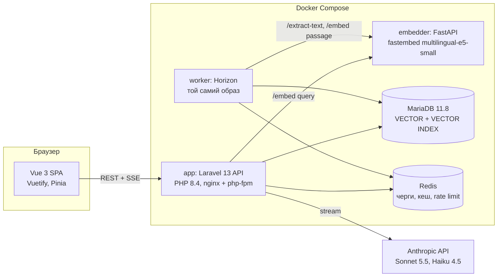
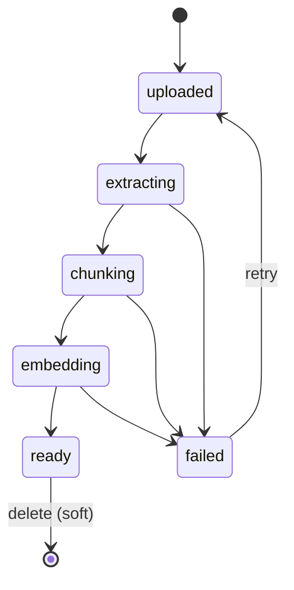
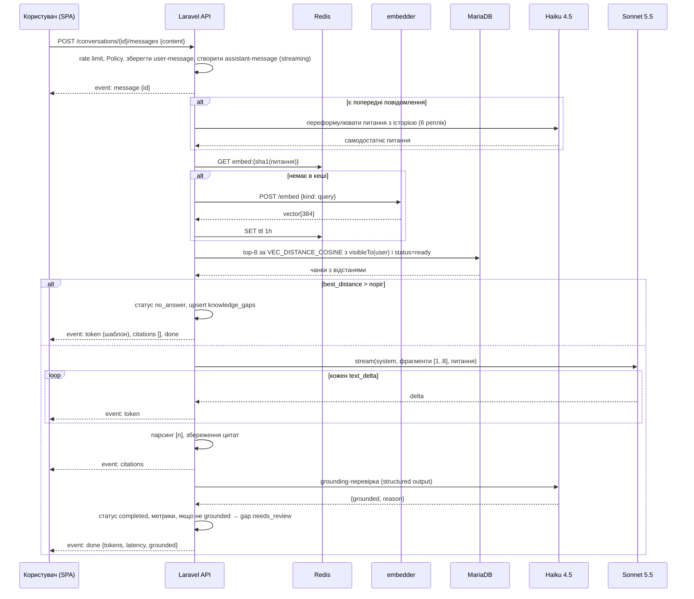

# Архітектура. Онбординг-наставник

Дата: 2026-10-06. Джерело: розділи 5–7 спеки `docs/superpowers/specs/2026-10-06-onboarding-mentor-design.md`.

## 5. Архітектура (архітектор)

### 5.1. Компоненти



Модулі Laravel (папки в `app/`): `Knowledge` (документи, чанки, інжест), `Retrieval` (пошук, ембединг запиту), `Chat` (розмови, повідомлення, стрімінг, цитати), `Insights` (прогалини, статистика), `Auth`. Інтеграції за інтерфейсами з фейками: `EmbeddingProvider`, `TextExtractor`, `LlmClient`.

Сайдкар не має стану і бази. Він знає лише тексти й файли, не знає про користувачів, документи чи аудиторії. Усі доменні рішення в Laravel.

### 5.2. Рішення, зафіксовані в ADR

| ADR | Рішення | Відхилені альтернативи |
|---|---|---|
| 0001 | Laravel володіє RAG, Python лише `/embed` і `/extract-text` | Python володіє RAG; Laravel без Python |
| 0002 | MariaDB Vector як векторне сховище | pgvector, Qdrant, Meilisearch |
| 0003 | Локальна модель ембедингів через fastembed | Voyage AI, OpenAI embeddings (перемикається драйвером) |
| 0004 | REST API + Vue SPA з Sanctum cookie | Inertia.js |
| 0005 | SSE через StreamedResponse для стрімінгу | WebSocket (Reverb), polling |
| 0006 | Grounding-перевірка після відповіді, не блокує стрім | Блокуюча перевірка до показу |

## 6. Модель даних (архітектор)

Single-tenant, тому без `company_id`. Усі id `bigint unsigned`, часові поля `created_at`/`updated_at`, якщо не вказано інше.

| Таблиця | Поля | Примітки |
|---|---|---|
| `departments` | name | |
| `users` | name, email, password, role enum(hr_admin, employee), department_id FK nullable, job_role string nullable | |
| `documents` | title, original_filename, mime, size_bytes, sha256 char(64) unique, storage_path, audience_type enum(all, department, role), audience_value string nullable, status enum(uploaded, extracting, chunking, embedding, ready, failed), failure_code string nullable, failure_message text nullable, version smallint default 1, chunks_count int default 0, uploaded_by FK users, deleted_at | Soft delete |
| `document_chunks` | document_id FK cascade, position smallint, page smallint nullable, heading string nullable, content text, token_count smallint, embedding VECTOR(384) NOT NULL | `VECTOR INDEX (embedding) M=8 DISTANCE=cosine`, index (document_id, position) |
| `ingestion_runs` | document_id FK cascade, step enum(extract, chunk, embed), status enum(running, done, failed), attempt tinyint, started_at, finished_at nullable, error text nullable | Журнал пайплайна |
| `conversations` | user_id FK, title string nullable, last_message_at | |
| `messages` | conversation_id FK cascade, role enum(user, assistant), content text, status enum(streaming, completed, failed, no_answer), rewritten_question text nullable, grounded bool nullable, model string nullable, input_tokens int nullable, output_tokens int nullable, latency_ms int nullable, best_distance decimal(6,4) nullable | Метрики на кожну відповідь |
| `message_citations` | message_id FK cascade, chunk_id FK nullable on delete set null, marker tinyint, quote text | `chunk_id` null означає «джерело видалено» |
| `knowledge_gaps` | question_normalized string unique, question_example text, occurrences int default 1, status enum(open, needs_review, resolved), resolved_document_id FK nullable, last_asked_at | |

Міграція чанків пише DDL сирим SQL, бо Schema Builder не знає тип VECTOR. Це єдине місце з raw DDL. Пошук виконує один клас `ChunkSearchRepository`, єдине місце з raw SELECT.

Обмеження MariaDB: векторний індекс застосовується лише до `ORDER BY VEC_DISTANCE_COSINE(...) LIMIT N` без інших умов. Тому пошук іде у два кроки в одному SQL: внутрішній підзапит бере top-K кандидатів за індексом (K = `config('rag.candidate_limit')`, стартове значення 100), зовнішній запит приєднує документи, застосовує фільтр аудиторії, статус ready і soft delete, і повертає top-k. Фільтр аудиторії все одно виконується в SQL до генерації, безпека не залежить від K.

Фільтр аудиторії це Eloquent-scope `Document::visibleTo(User $user)`:

```
audience_type = 'all'
OR (audience_type = 'department' AND audience_value = user.department_id)
OR (audience_type = 'role' AND audience_value = user.job_role)
```

Він застосовується і в пошуку чанків (join на documents), і в `GET /chunks/{id}`, і в будь-якому майбутньому ресурсі, що читає чанки. Нових шляхів доступу до чанків без цього scope бути не може, це правило в CLAUDE.md.

### Стани документа



## 7. Потоки (архітектор)

### 7.1. Інжест

`POST /documents` рахує sha256 потоком, перевіряє унікальність, зберігає файл у `storage/app/knowledge/{sha256}.{ext}`, створює документ у статусі `uploaded` і диспатчить `Bus::chain` з трьох job-ів у чергу `ingestion`.

1. `ExtractDocumentText`. Статус → `extracting`. PDF і DOCX через `TextExtractor` (сайдкар `/extract-text`), Markdown і TXT локально. Результат у `storage/app/knowledge/{sha256}.pages.json` як масив `{page, text}`. Порожній текст → failed з кодом `no_text_layer`.
2. `ChunkDocument`. Статус → `chunking`. Сервіс `Chunker`: розбиває за заголовками (Markdown `#`, у PDF рядки до 80 символів у верхньому регістрі або з нумерацією), далі за абзацами, цільовий розмір 400 токенів, перекриття 60 токенів, токени рахуються наближено як символи/4 для кирилиці й латиниці однаково. Зберігає сторінку й найближчий заголовок. Результат у `{sha256}.chunks.json`. Чанки в базу поки не пишуться, бо колонка embedding NOT NULL.
3. `EmbedDocumentChunks`. Статус → `embedding`. Пачками по 32 через `EmbeddingProvider::embedPassages()`, кожна пачка вставляється однією транзакцією. Після останньої пачки `chunks_count` і статус `ready`.

Кожен job: `tries = 3`, `backoff = [10, 30, 90]`, запис в `ingestion_runs` на старті й завершенні, у `failed()` переводить документ у `failed` з кодом (`extractor_unavailable`, `embedder_unavailable`, `no_text_layer`, `unsupported_format`, `unknown`). Ідемпотентність: job перед роботою перевіряє поточний статус і виходить, якщо документ уже далі по ланцюжку або видалений.

Retry (`POST /documents/{id}/retry`) дозволений лише зі статусу `failed`, інакше 409. У транзакції видаляє чанки й `ingestion_runs`, ставить `uploaded`, диспатчить ланцюжок.

### 7.2. Відповідь



Деталі:
- Переформулювання робиться лише коли в розмові вже є хоча б одна пара повідомлень. Результат зберігається в `messages.rewritten_question` для прозорості й відладки.
- Поріг релевантності: `config('rag.max_distance')`, стартове значення 0.35, калібрується на evals (AC-9).
- Top-k: `config('rag.top_k')`, стартове значення 8.
- Промпт для Sonnet: системна частина з правилами, user-частина з нумерованими фрагментами (`[1] Назва документа, стор. 3: текст`) і питанням. Правила: відповідати лише на основі фрагментів, кожне твердження з маркером, якщо фрагменти не містять відповіді, сказати це прямо одним реченням, відповідати мовою питання, без вигаданих посилань і дат.
- Парсинг цитат: регулярний вираз `\[(\d+)\]`, маркери поза діапазоном 1..k відкидаються й логуються. Якщо після парсингу жодного валідного маркера, а відповідь не є відмовою, повідомлення позначається `grounded = false` незалежно від Haiku.
- Grounding-перевірка: Haiku 4.5 отримує фрагменти й відповідь, повертає структуровану відповідь за JSON-схемою `{grounded: boolean, reason: string}`. Виконується після `citations`, не блокує показ тексту.
- Розрив з'єднання клієнтом: сервер ловить `connection_aborted()`, завершує стрім, зберігає часткову відповідь зі статусом `failed` і причиною `client_disconnected`.

### 5.3. Реєстр ADR

| ADR | Рішення | Файл |
|---|---|---|
| 0001 | Laravel володіє RAG | [0001-laravel-owns-rag.md](adr/0001-laravel-owns-rag.md) |
| 0002 | MariaDB Vector як векторне сховище | [0002-mariadb-vector-store.md](adr/0002-mariadb-vector-store.md) |
| 0003 | Локальні ембединги через fastembed | [0003-local-embeddings-fastembed.md](adr/0003-local-embeddings-fastembed.md) |
| 0004 | REST API + Vue SPA з Sanctum cookie | [0004-rest-api-spa-sanctum.md](adr/0004-rest-api-spa-sanctum.md) |
| 0005 | SSE через StreamedResponse | [0005-sse-streamed-response.md](adr/0005-sse-streamed-response.md) |
| 0006 | Grounding-перевірка після відповіді | [0006-grounding-after-answer.md](adr/0006-grounding-after-answer.md) |

Роль: архітектор
