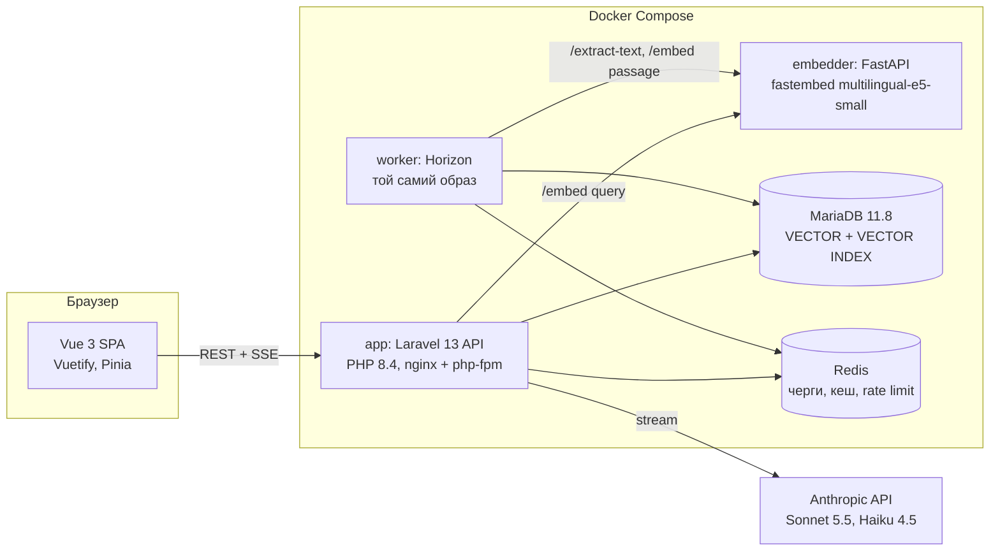
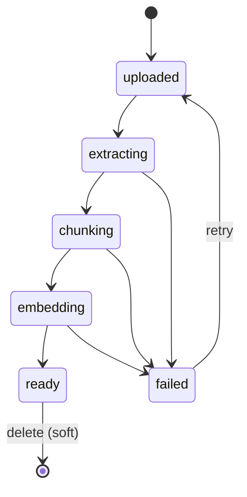
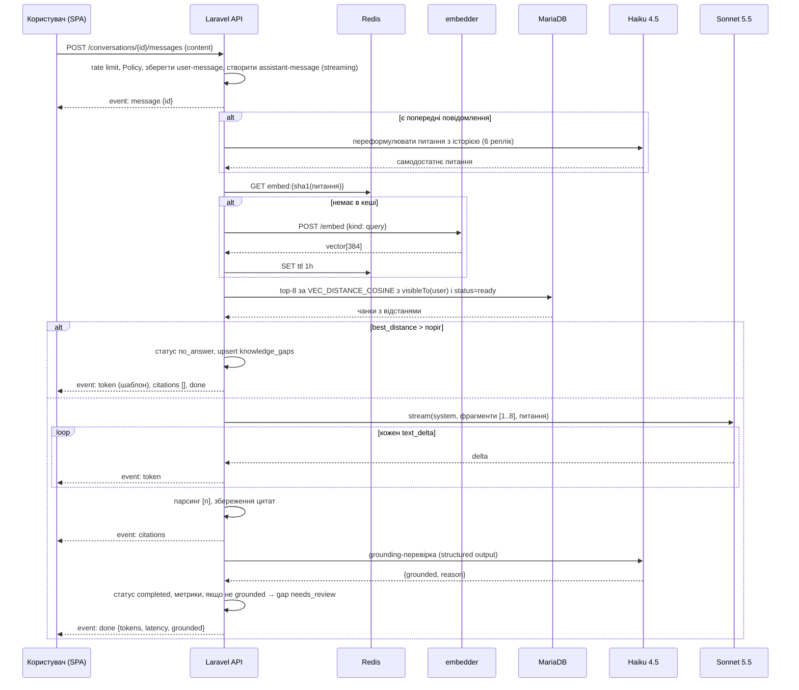

# Онбординг-наставник на базі знань компанії. Дизайн-спека

Дата: 2026-10-06. Статус: чернетка на рев'ю. Автор: Олег (ролі позначені в кожному розділі).

## 1. Мета і контекст

Hurma System це HRM + ATS + OKR для 1 000+ команд, single-tenant SaaS на PHP (Laravel) + Vue. Кейс будується на Laravel 13 (актуальна версія на жовтень 2026, PHP 8.3+), частково Python, MariaDB, Redis, Kubernetes. Команда переходить на AI-first розробку (Claude Code, Spec-Driven Development).

Цей проєкт це публічний кейс: одна продуктова фіча для модуля онбордингу Hurma, зроблена з нуля за процесом Spec-Driven Development, з повним слідом артефактів від brief до рев'ю. Фіча має бути реальною, запускатися однією командою і проходити тести. Кейс адресований тех ліду Hurma, але має бути зрозумілий будь-якому технічному рев'юеру.

Проблема, яку розв'язує фіча: новачок у перші тижні ставить десятки питань про політики, процеси та інструменти компанії. Відповіді розкидані по документах, HR і тімліди витрачають час на одне й те саме. Наставник відповідає з документів компанії, показує джерело і збирає питання без відповіді, щоб HR бачив, яких документів не вистачає.

## 2. Користувачі та ролі

| Роль у системі | Хто | Що робить |
|---|---|---|
| `hr_admin` | HR-менеджер | Завантажує документи, задає аудиторію, бачить статуси інжесту, звіт прогалин, статистику |
| `employee` | Новачок або будь-який співробітник | Веде розмови з наставником, бачить лише документи своєї аудиторії |

Користувач має `department_id` і `job_role`. Для демо сідер створює 1 HR-адміна, 2 відділи, 3 співробітників з різними відділами і ролями.

## 3. Межі

### Входить у v1

- Завантаження PDF, DOCX, Markdown, TXT до 20 МБ з назвою, аудиторією (всі, відділ, роль) і версією.
- Фоновий пайплайн інжесту зі станами й журналом кроків, повтор після збою.
- Чат зі стрімінгом відповіді, історія розмов, цитати виду [n] з переходом на документ і фрагмент.
- Фільтр аудиторії до генерації, на рівні SQL.
- Гілка «у базі знань цього немає» без вигадок, запис питання у прогалини.
- Сторінка прогалин для HR зі статусами й закриттям документом.
- Eval-набір і команда оцінки якості пошуку й цитування.
- Docker Compose для локального запуску, CI на GitHub Actions.

### Поза межами v1

Гібридний пошук із FULLTEXT, реранкер, Google Docs як джерело, кредити за AI-функції, багатомовний інтерфейс (UI українською, відповідь мовою питання), OCR для сканів, Kubernetes/Helm (лише опис у runbook), мобільний клієнт.

## 4. Критерії приймання

Кожен критерій стає тестом або eval-метрикою. Ідентифікатори використовуються в плані й комітах.

| ID | Критерій | Як перевіряється |
|---|---|---|
| AC-1 | HR завантажує PDF/DOCX/MD/TXT до 20 МБ, документ проходить uploaded → extracting → chunking → embedding → ready, кожен крок записаний в `ingestion_runs` | Feature-тест з фейковим сайдкаром |
| AC-2 | Повторне завантаження файлу з тим самим sha256 повертає наявний документ і не створює чанків | Feature-тест |
| AC-3 | Збій сайдкара переводить документ у failed з кодом причини після 3 спроб, черга не блокується | Feature-тест з фейком, що кидає виняток |
| AC-4 | Retry failed-документа чистить старі чанки і проходить пайплайн заново | Feature-тест |
| AC-5 | Співробітник відділу A не отримує чанк документа з аудиторією «відділ B» ні в пошуку, ні через `GET /chunks/{id}` | Негативний Feature-тест, обов'язковий |
| AC-6 | Відповідь з джерелами містить хоча б один маркер [n], і кожен маркер відповідає chunk_id з результатів пошуку цього запиту | Feature-тест з фейковим LLM + eval-метрика «галюциновані цитати = 0» |
| AC-7 | Якщо найкраща косинусна відстань більша за поріг, Sonnet не викликається, повідомлення отримує статус `no_answer`, у `knowledge_gaps` з'являється або інкрементується запис | Feature-тест |
| AC-8 | SSE-потік містить події `message`, `token`, `citations`, `done` у такому порядку, або `message`, `error` | Feature-тест |
| AC-9 | Eval на 30 пар: recall@5 ≥ 0.80, частка відповідей з цитатами на існуючі чанки = 100 %, частка grounded ≥ 0.90 | `php artisan rag:eval`, результат у `docs/04-evals.md` |
| AC-10 | Видалення документа прибирає його чанки з пошуку негайно, цитати в старих повідомленнях показують «джерело видалено» | Feature-тест |
| AC-11 | `docker compose up` піднімає систему, сідер створює демо-дані, `make demo` завантажує 5 документів вигаданої компанії | Runbook, ручна перевірка, smoke-тест у CI |
| AC-12 | Rate limit 20 повідомлень на хвилину на користувача, 429 з `Retry-After` | Feature-тест |

## 5. Архітектура (архітектор)

### 5.1. Компоненти



Модулі Laravel (папки в `app/`): `Knowledge` (документи, чанки, інжест), `Retrieval` (пошук, ембединг запиту), `Chat` (розмови, повідомлення, стрімінг, цитати), `Insights` (прогалини, статистика), `Auth`. Інтеграції за інтерфейсами з фейками: `EmbeddingProvider`, `TextExtractor`, `LlmClient`.

Сайдкар не має стану і бази. Він знає лише тексти й файли, не знає про користувачів, документи чи аудиторії. Усі доменні рішення в Laravel.

### 5.2. Рішення, зафіксовані в ADR

| ADR | Рішення | Відхилені альтернативи |
|---|---|---|
| 0001 | Laravel володіє RAG, Python лише `/embed` і `/extract-text` | Python володіє RAG; Laravel без Python |
| 0002 | MariaDB Vector як векторне сховище | pgvector, Qdrant, Meilisearch |
| 0003 | Локальна модель ембедингів через fastembed | Voyage AI, OpenAI embeddings (перемикається драйвером) |
| 0004 | REST API + Vue SPA з Sanctum cookie | Inertia.js |
| 0005 | SSE через StreamedResponse для стрімінгу | WebSocket (Reverb), polling |
| 0006 | Grounding-перевірка після відповіді, не блокує стрім | Блокуюча перевірка до показу |

## 6. Модель даних (архітектор)

Single-tenant, тому без `company_id`. Усі id `bigint unsigned`, часові поля `created_at`/`updated_at`, якщо не вказано інше.

| Таблиця | Поля | Примітки |
|---|---|---|
| `departments` | name | |
| `users` | name, email, password, role enum(hr_admin, employee), department_id FK nullable, job_role string nullable | |
| `documents` | title, original_filename, mime, size_bytes, sha256 char(64) unique, storage_path, audience_type enum(all, department, role), audience_value string nullable, status enum(uploaded, extracting, chunking, embedding, ready, failed), failure_code string nullable, failure_message text nullable, version smallint default 1, chunks_count int default 0, uploaded_by FK users, deleted_at | Soft delete |
| `document_chunks` | document_id FK cascade, position smallint, page smallint nullable, heading string nullable, content text, token_count smallint, embedding VECTOR(384) NOT NULL | `VECTOR INDEX (embedding) M=8 DISTANCE=cosine`, index (document_id, position) |
| `ingestion_runs` | document_id FK cascade, step enum(extract, chunk, embed), status enum(running, done, failed), attempt tinyint, started_at, finished_at nullable, error text nullable | Журнал пайплайна |
| `conversations` | user_id FK, title string nullable, last_message_at | |
| `messages` | conversation_id FK cascade, role enum(user, assistant), content text, status enum(streaming, completed, failed, no_answer), rewritten_question text nullable, grounded bool nullable, model string nullable, input_tokens int nullable, output_tokens int nullable, latency_ms int nullable, best_distance decimal(6,4) nullable | Метрики на кожну відповідь |
| `message_citations` | message_id FK cascade, chunk_id FK nullable on delete set null, marker tinyint, quote text | `chunk_id` null означає «джерело видалено» |
| `knowledge_gaps` | question_normalized string unique, question_example text, occurrences int default 1, status enum(open, needs_review, resolved), resolved_document_id FK nullable, last_asked_at | |

Міграція чанків пише DDL сирим SQL, бо Schema Builder не знає тип VECTOR. Це єдине місце з raw DDL. Пошук виконує один клас `ChunkSearchRepository`, єдине місце з raw SELECT.

Обмеження MariaDB: векторний індекс застосовується лише до `ORDER BY VEC_DISTANCE_COSINE(...) LIMIT N` без інших умов. Тому пошук іде у два кроки в одному SQL: внутрішній підзапит бере top-K кандидатів за індексом (K = `config('rag.candidate_limit')`, стартове значення 100), зовнішній запит приєднує документи, застосовує фільтр аудиторії, статус ready і soft delete, і повертає top-k. Фільтр аудиторії все одно виконується в SQL до генерації, безпека не залежить від K.

Фільтр аудиторії це Eloquent-scope `Document::visibleTo(User $user)`:

```
audience_type = 'all'
OR (audience_type = 'department' AND audience_value = user.department_id)
OR (audience_type = 'role' AND audience_value = user.job_role)
```

Він застосовується і в пошуку чанків (join на documents), і в `GET /chunks/{id}`, і в будь-якому майбутньому ресурсі, що читає чанки. Нових шляхів доступу до чанків без цього scope бути не може, це правило в CLAUDE.md.

### Стани документа



## 7. Потоки (архітектор)

### 7.1. Інжест

`POST /documents` рахує sha256 потоком, перевіряє унікальність, зберігає файл у `storage/app/knowledge/{sha256}.{ext}`, створює документ у статусі `uploaded` і диспатчить `Bus::chain` з трьох job-ів у чергу `ingestion`.

1. `ExtractDocumentText`. Статус → `extracting`. PDF і DOCX через `TextExtractor` (сайдкар `/extract-text`), Markdown і TXT локально. Результат у `storage/app/knowledge/{sha256}.pages.json` як масив `{page, text}`. Порожній текст → failed з кодом `no_text_layer`.
2. `ChunkDocument`. Статус → `chunking`. Сервіс `Chunker`: розбиває за заголовками (Markdown `#`, у PDF рядки до 80 символів у верхньому регістрі або з нумерацією), далі за абзацами, цільовий розмір 400 токенів, перекриття 60 токенів, токени рахуються наближено як символи/4 для кирилиці й латиниці однаково. Зберігає сторінку й найближчий заголовок. Результат у `{sha256}.chunks.json`. Чанки в базу поки не пишуться, бо колонка embedding NOT NULL.
3. `EmbedDocumentChunks`. Статус → `embedding`. Пачками по 32 через `EmbeddingProvider::embedPassages()`, кожна пачка вставляється однією транзакцією. Після останньої пачки `chunks_count` і статус `ready`.

Кожен job: `tries = 3`, `backoff = [10, 30, 90]`, запис в `ingestion_runs` на старті й завершенні, у `failed()` переводить документ у `failed` з кодом (`extractor_unavailable`, `embedder_unavailable`, `no_text_layer`, `unsupported_format`, `unknown`). Ідемпотентність: job перед роботою перевіряє поточний статус і виходить, якщо документ уже далі по ланцюжку або видалений.

Retry (`POST /documents/{id}/retry`) дозволений лише зі статусу `failed`, інакше 409. У транзакції видаляє чанки й `ingestion_runs`, ставить `uploaded`, диспатчить ланцюжок.

### 7.2. Відповідь



Деталі:
- Переформулювання робиться лише коли в розмові вже є хоча б одна пара повідомлень. Результат зберігається в `messages.rewritten_question` для прозорості й відладки.
- Поріг релевантності: `config('rag.max_distance')`, стартове значення 0.35, калібрується на evals (AC-9).
- Top-k: `config('rag.top_k')`, стартове значення 8.
- Промпт для Sonnet: системна частина з правилами, user-частина з нумерованими фрагментами (`[1] Назва документа, стор. 3: текст`) і питанням. Правила: відповідати лише на основі фрагментів, кожне твердження з маркером, якщо фрагменти не містять відповіді, сказати це прямо одним реченням, відповідати мовою питання, без вигаданих посилань і дат.
- Парсинг цитат: регулярний вираз `\[(\d+)\]`, маркери поза діапазоном 1..k відкидаються й логуються. Якщо після парсингу жодного валідного маркера, а відповідь не є відмовою, повідомлення позначається `grounded = false` незалежно від Haiku.
- Grounding-перевірка: Haiku 4.5 отримує фрагменти й відповідь, повертає структуровану відповідь за JSON-схемою `{grounded: boolean, reason: string}`. Виконується після `citations`, не блокує показ тексту.
- Розрив з'єднання клієнтом: сервер ловить `connection_aborted()`, завершує стрім, зберігає часткову відповідь зі статусом `failed` і причиною `client_disconnected`.

## 8. API Laravel (аналітик, архітектор)

Префікс `/api/v1`, JSON, автентифікація Sanctum SPA cookie (CSRF через `/sanctum/csrf-cookie`). Усі відповіді зі списками пагіновані (`per_page` до 100). Помилки у форматі `{"error": {"code": "...", "message": "...", "details": {}}}`.

### Auth

| Метод | Шлях | Опис |
|---|---|---|
| POST | `/auth/login` | email, password → 204, cookie |
| POST | `/auth/logout` | 204 |
| GET | `/me` | користувач з роллю, відділом, job_role |

### Knowledge (Policy: лише hr_admin)

| Метод | Шлях | Опис |
|---|---|---|
| GET | `/documents` | список зі статусом, chunks_count, аудиторією; фільтр `status` |
| POST | `/documents` | multipart: file, title, audience_type, audience_value (обов'язкове для department/role). 202 з документом. Якщо sha256 уже є → 200 з наявним |
| GET | `/documents/{id}` | документ + `ingestion_runs` |
| POST | `/documents/{id}/retry` | 202 або 409, якщо статус не failed |
| DELETE | `/documents/{id}` | 204, soft delete, чанки одразу поза пошуком |
| GET | `/documents/{id}/chunks` | пагіновано, для перегляду нарізки |

### Chat (будь-який автентифікований)

| Метод | Шлях | Опис |
|---|---|---|
| GET | `/conversations` | розмови користувача за `last_message_at` desc |
| POST | `/conversations` | 201, порожня розмова |
| GET | `/conversations/{id}/messages` | повідомлення з цитатами (chunk, document title, page, quote) |
| POST | `/conversations/{id}/messages` | body `{content}` (1..2000 символів). Відповідь `text/event-stream`, див. 8.1. Rate limit 20/хв на користувача |
| GET | `/chunks/{id}` | чанк з документом для панелі «джерело», через visibleTo, інакше 404 |

### Insights (лише hr_admin)

| Метод | Шлях | Опис |
|---|---|---|
| GET | `/gaps` | фільтр `status`, сортування за occurrences desc |
| PATCH | `/gaps/{id}` | `{status, resolved_document_id?}` |
| GET | `/stats` | documents_by_status, questions_7d, no_answer_7d, grounded_rate_7d, avg_latency_ms_7d |

### 8.1. Формат SSE

Кожна подія: `event: <name>` і `data: <json>`. Порядок у штатному сценарії: `message`, `token`×N, `citations`, `done`. У сценарії збою: `message`, можливо кілька `token`, потім `error`.

| Подія | data |
|---|---|
| `message` | `{"id": 123, "conversation_id": 7}` |
| `token` | `{"text": "фрагмент"}` |
| `citations` | `[{"marker": 1, "chunk_id": 55, "document_id": 3, "document_title": "...", "page": 2, "quote": "..."}]` |
| `done` | `{"status": "completed", "grounded": true, "input_tokens": 1800, "output_tokens": 240, "latency_ms": 2900}` |
| `error` | `{"code": "llm_unavailable", "message": "..."}` |

Nginx для цього маршруту: `proxy_buffering off`, `X-Accel-Buffering: no`, таймаут 120 с. PHP: `ob_implicit_flush`, без gzip на маршруті.

## 9. Контракт сайдкара `embedder` (архітектор)

FastAPI, Python 3.12, `fastembed` з моделлю `intfloat/multilingual-e5-small`, підключеною через `TextEmbedding.add_custom_model` (ONNX, mean pooling, нормалізація, 384 виміри). Доступний лише у внутрішній мережі Compose, без автентифікації. Модель завантажується при старті образу (вшита в образ на етапі build), не під час запиту.

| Метод | Шлях | Запит | Відповідь |
|---|---|---|---|
| POST | `/embed` | `{"texts": ["..."], "kind": "query" \| "passage"}`, 1..64 текстів, кожен до 8 000 символів | `{"vectors": [[...384 float]], "model": "intfloat/multilingual-e5-small", "dim": 384}` |
| POST | `/extract-text` | multipart `file`, PDF або DOCX, до 20 МБ | `{"pages": [{"page": 1, "text": "..."}], "meta": {"pages_count": 12, "title": null}}`. DOCX повертає одну «сторінку» з абзацами через `\n\n` |
| GET | `/health` | | `{"status": "ok", "model": "...", "dim": 384}` |

Правило моделі e5: fastembed для custom-моделі префіксів не додає, тому сервіс сам додає префікс `query: ` або `passage: ` залежно від `kind`. Laravel передає чисті тексти. Помилки: 422 на порожній масив або невідомий формат файлу, 413 на перевищення розміру, 500 з `{"error": "..."}`.

Laravel-клієнт: таймаут 30 с на `/embed`, 120 с на `/extract-text`, без ретраїв на рівні HTTP (ретраї робить job).

## 10. LLM: моделі, параметри, промпти (архітектор, QA)

Офіційний PHP SDK `anthropic-ai/sdk`, за інтерфейсом `LlmClient` з методами `streamAnswer()`, `rewriteQuestion()`, `checkGrounding()`. Реалізації: `AnthropicLlmClient`, `FakeLlmClient` (детерміновані відповіді з фікстур для тестів і CI).

| Крок | Модель | Параметри |
|---|---|---|
| Відповідь | `claude-sonnet-5-5` | стрімінг, `maxTokens` 2048, `outputConfig.effort` low, системний промпт з `cacheControl` ephemeral |
| Переформулювання | `claude-haiku-4-5` | `maxTokens` 256, без thinking |
| Grounding | `claude-haiku-4-5` | `maxTokens` 256, structured output за схемою `{grounded, reason}` |

Усі виклики перевіряють `stopReason`: `refusal` і `max_tokens` обробляються як помилки з окремими кодами (`llm_refusal`, `llm_truncated`), повідомлення отримує статус failed, у відповідь іде подія `error`. Типові винятки SDK (rate limit, overloaded, connection) маплюються на код `llm_unavailable`, без ретраїв у стрімі.

Промпти лежать у `resources/prompts/` як Markdown з версією в імені (`answer.v1.md`, `rewrite.v1.md`, `grounding.v1.md`). Зміна промпту це нова версія файлу плюс оновлення snapshot-тесту плюс прогін `rag:eval` із записом результату в `docs/04-evals.md`. Модель, що використана, записується в `messages.model`.

Кошти: при 30 eval-питаннях і 50 демо-питаннях очікувано менше 2 долари на весь проєкт. Моделі перемикаються через `config/rag.php` без зміни коду.

## 11. Безпека і GDPR (архітектор)

- Policy на кожен ресурс, тести на 403 для employee на Knowledge і Insights.
- Фільтр аудиторії лише через scope `visibleTo`, застосований у SQL до генерації. Жодного шляху до чанків без нього.
- Сайдкар недоступний зовні, у Compose без опублікованих портів.
- Завантаження: whitelist mime (`application/pdf`, DOCX, `text/markdown`, `text/plain`), перевірка розширення й сигнатури файлу, 20 МБ, файл зберігається під sha256, не під оригінальним ім'ям. Антивірус поза межами, зафіксовано в runbook.
- У промпт не потрапляють персональні дані користувача: ні ім'я, ні email, ні відділ. Аудиторія це фільтр до запиту.
- Локальні ембединги: повний текст документів не покидає інстанс. До Anthropic ідуть лише релевантні фрагменти (до 8 × 400 токенів) і питання.
- Видалення документа: soft delete виключає чанки з пошуку негайно, нічне прибирання жорстко видаляє файл і чанки, цитати отримують `chunk_id = null`.
- Видалення користувача каскадом прибирає розмови й повідомлення.
- Секрети лише в `.env`, у репозиторії `.env.example` із порожніми значеннями. Правило в CLAUDE.md: без секретів і реальних персональних даних у коді, фікстурах, промптах, журналах сесій.

## 12. Помилки та стійкість (архітектор)

| Ситуація | Поведінка |
|---|---|
| Сайдкар недоступний під час інжесту | job 3 спроби з backoff, потім документ failed `embedder_unavailable` або `extractor_unavailable` |
| Сайдкар недоступний під час питання | подія `error` з кодом `embedder_unavailable`, повідомлення failed, користувач бачить «спробуйте пізніше» |
| Anthropic 429/529/мережа | подія `error` `llm_unavailable`, без автоматичних ретраїв у стрімі |
| Anthropic refusal або обрив по max_tokens | `llm_refusal` або `llm_truncated`, часткова відповідь зберігається |
| Клієнт закрив вкладку під час стріму | часткова відповідь зберігається зі статусом failed `client_disconnected` |
| MariaDB недоступна | стандартна 503 Laravel, Horizon тримає job у черзі |
| Файл без текстового шару | failed `no_text_layer`, підказка в UI «потрібен OCR» |
| Документ видалено під час інжесту | job бачить `deleted_at` і виходить без помилки |

## 13. Спостережуваність (DevOps)

Структуровані JSON-логи з полями `conversation_id`, `message_id`, `document_id`, `step`. Horizon як дашборд черг. Sentry через `SENTRY_LARAVEL_DSN`, у демо порожній. Метрики відповідей у таблиці `messages`, агрегати в `GET /stats`. Health: `GET /up` у Laravel, `GET /health` у сайдкара, обидва в healthcheck Compose.

## 14. Тестування та evals (QA)

### Unit (Pest)

- `Chunker`: розміри, перекриття, збереження сторінки й заголовка, порожній вхід, один довгий абзац, Markdown-заголовки.
- `CitationParser`: маркери в тексті, дубльовані, поза діапазоном, відсутні.
- `QuestionNormalizer` для `knowledge_gaps`: нижній регістр, пунктуація, пробіли.
- `FakeEmbeddingProvider`: детерміновані вектори з sha1 тексту, нормалізовані.

### Feature (Pest, MariaDB 11.8 у Docker або CI service)

Покривають AC-1..AC-8, AC-10, AC-12 і 403 для Policy. Усі з фейками провайдерів. Негативний тест аудиторії (AC-5) перевіряє і пошук, і `GET /chunks/{id}`.

### Контрактні тести сайдкара (pytest)

`/embed`: dim 384, норма вектора ≈ 1, різні вектори для query і passage одного тексту, 422 на порожній масив. `/extract-text`: PDF-фікстура з 2 сторінками, DOCX-фікстура, 422 на PNG.

### Фронт (vitest)

Pinia-стор чату: обробка подій SSE, порядок, помилка. Компонент цитати: клік відкриває панель джерела.

### Snapshot-тести промптів

Зібраний промпт для фіксованого набору фрагментів і питання порівнюється зі snapshot. Зміна промпту видима в diff.

### Evals (`php artisan rag:eval`)

Набір `tests/evals/dataset.yaml`: 30 записів `{question, expected_document, expected_keywords[]}` для вигаданої компанії «Vesna Tech» з 5 документами (політика відпусток, онбординг-гайд, політика безпеки, процес code review, довідник пільг). 24 питання з відповіддю, 6 без відповіді в базі. Метрики: recall@5 (очікуваний документ серед top-5 чанків), citation_validity (усі маркери відповідають чанкам пошуку), grounded_rate (Haiku), no_answer_precision (6 питань без відповіді отримали `no_answer`). Команда пише результат у `docs/04-evals.md` з датою, версією промптів, порогом і моделями. У CI запускається з фейками лише як smoke на працездатність команди.

## 15. Інфраструктура (DevOps)

`docker-compose.yml`: `app` (nginx + php-fpm, образ з Dockerfile на `php:8.4-fpm-alpine`), `worker` (той самий образ, команда `php artisan horizon`), `embedder` (Dockerfile на `python:3.12-slim`, модель вшита в образ), `mariadb:11.8`, `redis:7-alpine`, `vite` лише в dev-профілі. Томи для MariaDB, Redis і `storage/app/knowledge`. Healthcheck на всіх, `depends_on` з `condition: service_healthy`.

`Makefile`: `make up`, `make seed`, `make demo` (завантажує 5 документів Vesna Tech через API), `make test`, `make eval`.

CI (GitHub Actions, `.github/workflows/ci.yml`): pint, phpstan рівень 6, pest з `mariadb:11.8` як service і фейками, pytest для сайдкара, vitest, `npm run build`. Jenkins і Kubernetes не реалізуються, у `05-runbook.md` є розділ «як це поїхало б у Hurma»: Helm-чарт на інстанс, міграції через Job перед деплоєм, сайдкар як окремий Deployment.

## 16. Процес Spec-Driven Development (тех лід)

### Структура репозиторію

```
docs/
  00-brief.md                      продакт
  01-spec.md                       аналітик (цей документ після рев'ю розкладається в 00–03)
  02-architecture.md               архітектор, Mermaid
  adr/000N-*.md                    архітектор
  03-plan.md                       тех лід
  04-evals.md                      QA
  05-runbook.md                    DevOps
  process/workflow.md              як іде цикл
  process/sessions/YYYY-MM-DD-*.md журнал сесій з Claude Code
  case/index.html                  техрайтер, сторінка-кейс
  superpowers/specs/, superpowers/plans/   робочі документи процесу
CLAUDE.md
.claude/skills/{laravel-feature,queued-job,vue-screen,prompt-change,adr}/SKILL.md
app/  resources/js/  services/embedder/  docker-compose.yml  .github/workflows/ci.yml
```

### Цикл задачі

1. Задача в `03-plan.md` посилається на AC-ідентифікатор і розділ спеки.
2. Агент отримує skill і контекст, пише тест, що падає, потім реалізацію, запускає перевірку зі skill.
3. Людське рев'ю diff. Кожне виправлення записується в журнал сесії одним рядком: що пішло не так, яке правило додано в CLAUDE.md або skill.
4. Коміт із посиланням на AC, CI зелений.

### Skills агента

| Skill | Одна дія | Перевірка |
|---|---|---|
| `laravel-feature` | міграція, модель, Policy, Form Request, Resource, Feature-тест за описом ресурсу зі спеки | `php artisan test --filter=<Name>` |
| `queued-job` | job з ідемпотентністю, tries/backoff, записом в `ingestion_runs`, тест на failed-гілку | `php artisan test --filter=<Job>` |
| `vue-screen` | Vuetify-екран, Pinia-стор, API-клієнт за контрактом розділу 8, vitest на стор | `npm run test -- <store>` |
| `prompt-change` | нова версія файлу промпту, оновлений snapshot, `rag:eval`, запис у `04-evals.md` | `php artisan rag:eval` |
| `adr` | ADR за шаблоном: контекст, рішення, альтернативи, наслідки | рев'ю |

### CLAUDE.md, ключові правила

Без секретів і реальних персональних даних у коді, фікстурах, промптах, журналах. Raw SQL лише у міграції чанків і `ChunkSearchRepository`. Будь-який доступ до чанків через `visibleTo`. Кожен PR додає або змінює тест. Промпти лише через `prompt-change`. Українська в документації й UI, англійська в коді та комітах.

### Ролі по етапах

| Етап | Роль | Артефакт |
|---|---|---|
| Постановка | продакт | `00-brief.md` |
| Вимоги | аналітик | `01-spec.md`, AC-таблиця |
| Дизайн | архітектор | `02-architecture.md`, ADR 0001–0006 |
| Планування | тех лід | `03-plan.md`, CLAUDE.md, skills |
| Реалізація | розробник + агент | код, тести, журнал сесій |
| Якість | QA | `04-evals.md`, негативні тести |
| Інфраструктура | DevOps | Compose, CI, `05-runbook.md` |
| Презентація | техрайтер | `case/index.html`, GIF, PDF |

## 17. Етапи й віхи

Старт 6 жовтня 2026.

| Дні | Дати | Що готово |
|---|---|---|
| 1–2 | 6–7.10 | brief, spec, architecture, ADR, plan, CLAUDE.md, skills. Показується на дзвінку 7.10 як процес |
| 3–7 | 8–12.10 | **Віха «вертикальний зріз»**: Compose, сайдкар, інжест Markdown і PDF, пошук, стрімінгова відповідь із цитатами в мінімальному чаті, AC-1, AC-6, AC-8. Лінк на репо готовий до надсилання |
| 8–12 | 13–17.10 | аудиторії (AC-5), адмінка документів зі статусами й retry (AC-2..AC-4), історія розмов, прогалини (AC-7), `/stats`, AC-10, AC-12 |
| 13–16 | 18–21.10 | evals і калібрування порогу (AC-9), CI, runbook, Horizon (AC-11) |
| 17–21 | 22–26.10 | сторінка-кейс зі схемами процесу й фічі, GIF 30–60 с, PDF, вичитка всіх документів, фінальне рев'ю |

## 18. Ризики та пом'якшення

| Ризик | Пом'якшення |
|---|---|
| Парсинг складних PDF (колонки, таблиці) дає поганий текст | pymupdf у сайдкарі, обмеження зафіксоване в runbook, демо-документи прості |
| Якість e5-small на українській нижча за хмарні моделі | evals покажуть реальні цифри, драйвер для Voyage описаний як наступний крок |
| Стрімінг через nginx і php-fpm буферизується | налаштування в розділі 8.1, перевірка на віхі дня 7 |
| Образ сайдкара великий, довгий холодний старт | fastembed/ONNX, модель вшита в образ на build |
| Обсяг на 3 тижні завеликий | віха дня 7 дає робочий зріз, далі функції додаються за пріоритетом AC |
| Витрати на LLM | Sonnet/Haiku, кеш системного промпту, evals вручну, у CI фейки |

## 19. Глосарій

- **Чанк**: фрагмент документа 300–500 токенів, одиниця пошуку й цитування.
- **Аудиторія**: правило видимості документа: всі, відділ або роль.
- **Grounding**: чи спирається відповідь лише на надані фрагменти.
- **Прогалина**: питання, на яке база знань не дала відповіді, або відповідь не пройшла grounding.
- **Spec-Driven Development**: спека з критеріями приймання як джерело правди для плану, коду, тестів і промптів агента.
